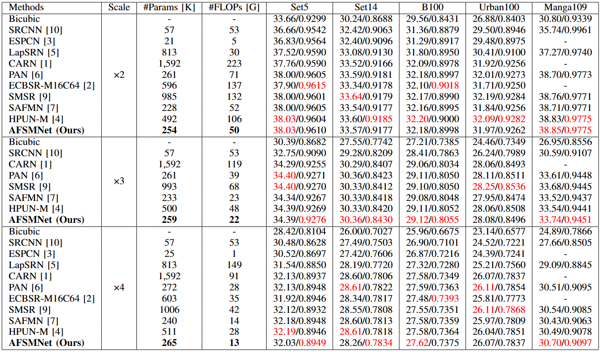

### 📖 [IEEE Signal Processing Letters] Adaptive Feature Selection Modulation Network for Efficient Image Super-Resolution [[Paper](https://ieeexplore.ieee.org/document/10909534)] <br>

> [Chen Wu](https://github.com/5chen), [Ling Wang](https://daviswang0.github.io/), [Xin Su](https://ieeexplore.ieee.org/author/37090018587), and [Zhuoran Zheng](https://scholar.google.com.hk/citations?user=pXzPL-sAAAAJ&hl=zh-CN) <br>

---
### Requirements
> - Python 3.8, PyTorch >= 1.11
> - BasicSR 1.4.2
> - Platforms: Ubuntu 18.04, cuda-11

### Installation
```
# Clone the repo
git clone https://github.com/DavisWANG0/AFSMNet.git
# Install dependent packages
cd AFSMNet
pip install -r requirements.txt
# Install BasicSR
python setup.py develop
```
You can also refer to this [INSTALL.md](https://github.com/XPixelGroup/BasicSR/blob/master/docs/INSTALL.md) for installation

### Training
Run the following commands for training:
```
# train AFSMNet for x2 effieicnt SR
python basicsr/train.py -opt options/train/AFSMNet/train_DF2K_x2.yml
# train AFSMNet for x3 effieicnt SR
python basicsr/train.py -opt options/train/AFSMNet/train_DF2K_x3.yml
# train AFSMNet for x4 effieicnt SR
python basicsr/train.py -opt options/train/AFSMNet/train_DF2K_x4.yml
```
### Testing 
- Download the testing dataset.
- Run the following commands:
```
# test AFSMNet for x2 efficient SR
python basicsr/test.py -opt options/test/AFSMNet/test_benchmark_x2.yml
# test AFSMNet for x3 efficient SR
python basicsr/test.py -opt options/test/AFSMNet/test_benchmark_x3.yml
# test AFSMNet for x4 efficient SR
python basicsr/test.py -opt options/test/AFSMNet/test_benchmark_x4.yml
```
- The test results will be in './results'.

### Results

### Citation
If this work is helpful for your research, please consider citing the following BibTeX entry.
```
@article{wu2025adaptive,
  title={Adaptive feature selection modulation network for efficient image super-resolution},
  author={Wu, Chen and Wang, Ling and Su, Xin and Zheng, Zhuoran},
  journal={IEEE Signal Processing Letters},
  year={2025},
  publisher={IEEE}
}
 ```


### Acknowledgement
This code is based on [BasicSR](https://github.com/XPixelGroup/BasicSR) toolbox and [SAFMN](https://github.com/sunny2109/SAFMN). Thanks for the awesome work.

### Contact
If you have any questions, please feel free to reach me out at davis0wang@outlook.com

